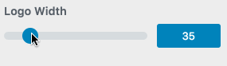

# WordPress Customizer Range Value Control

A generic range with value control you can use to replace the range control.



## Demo

I've added this control to my [customizer demo theme](https://github.com/soderlind/2016-customizer-demo).

## Installing the control

Clone this repository and include the class:

```php
/**
 * Check for WP_Customizer_Control existence before adding custom control because WP_Customize_Control
 * is loaded on customizer page only
 *
 * @see _wp_customize_include()
 */
if ( class_exists( 'WP_Customize_Control' ) ) {
	require_once( dirname(__FILE) . '/class-customizer-range-value-control.php' );
}
```

## Adding the control

```php
$wp_customize->add_control( new Customizer_Range_Value_Control( $wp_customize, 'my_control', array(
	'type'     => 'range-value',
	'section'  => 'my_section',
	'settings' => 'my_settings',
	'label'    => __( 'Width' ),
	'input_attrs' => array(
		'min'    => 1,
		'max'    => 240,
		'step'   => 1,
		'suffix' => 'px', //optional suffix
  	),
) ) );
```

## Credits

The CSS and JavaScript is  copyright (c) 2016 by Sean Stopnik

You can see his [demo at CodePen.io](http://codepen.io/thelifemgmt/pen/CeLqA)

The CSS and JavaScript is [licensed](https://blog.codepen.io/legal/licensing/) under the terms of the [MIT license](http://opensource.org/licenses/MIT)

## Copyright and License

WordPress Customizer Range Value Control is copyright 2016 Per Soderlind

WordPress Customizer Range Value Control is free software: you can redistribute it and/or modify it under the terms of the GNU General Public License as published by the Free Software Foundation, either version 2 of the License, or (at your option) any later version.

WordPress Customizer Range Value Control is distributed in the hope that it will be useful, but WITHOUT ANY WARRANTY; without even the implied warranty of MERCHANTABILITY or FITNESS FOR A PARTICULAR PURPOSE. See the GNU General Public License for more details.

You should have received a copy of the GNU Lesser General Public License along with the Extension. If not, see http://www.gnu.org/licenses/.
